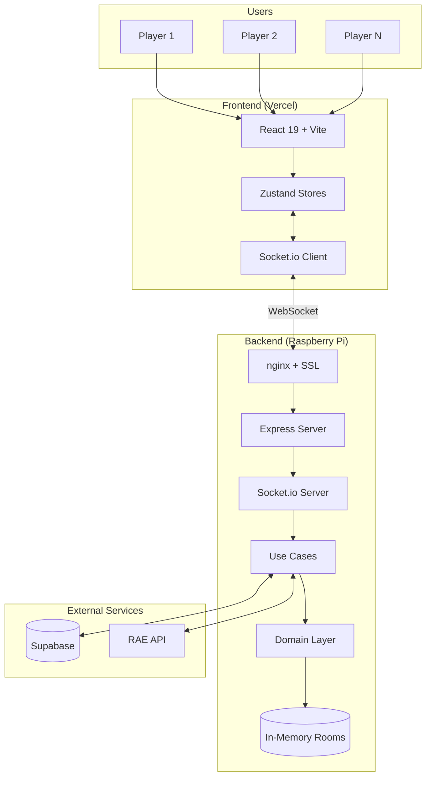
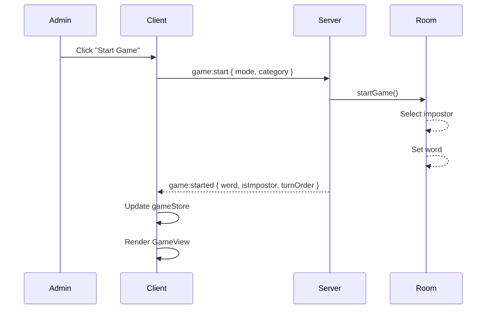
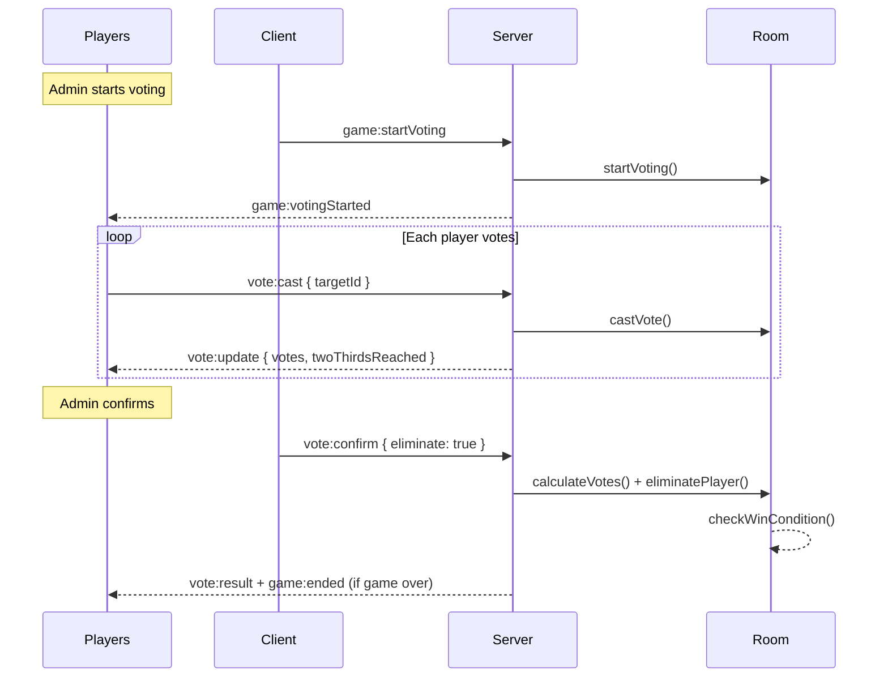

# Architecture

El Impostor follows a modern full-stack architecture with real-time communication via WebSockets.

## System Overview



---

## Server Architecture (Clean Architecture)

The server implements **Clean Architecture** with clear separation of concerns:

```
┌─────────────────────────────────────────────────────────────┐
│                    Infrastructure Layer                     │
│  ┌───────────────────────────────────────────────────────┐  │
│  │                   Application Layer                   │  │
│  │  ┌─────────────────────────────────────────────────┐  │  │
│  │  │                  Domain Layer                   │  │  │
│  │  │                                                 │  │  │
│  │  │   Room Entity    Player Entity    Errors        │  │  │
│  │  │                                                 │  │  │
│  │  └─────────────────────────────────────────────────┘  │  │
│  │                                                       │  │
│  │   Use Cases (Room, Game, Voting, Word)                │  │
│  │   Ports (Repository & Service interfaces)             │  │
│  │                                                       │  │
│  └───────────────────────────────────────────────────────┘  │
│                                                             │
│   Repositories    Services    Socket Handlers    REST API   │
│                                                             │
└─────────────────────────────────────────────────────────────┘
```

### Domain Layer

The core business logic, independent of frameworks.

**Entities:**
- `Room` - Game room with players, state, word, votes
- `Player` - Player with connection status, vote state

**Errors:**
- `RoomNotFoundError`
- `NotAdminError`
- `NotEnoughPlayersError`
- `GameAlreadyStartedError`
- etc.

```typescript
// server/src/domain/entities/Room.ts
export class Room {
  private props: RoomProps;

  startGame(word: string, category?: string, impostorCount?: number): Room;
  castVote(voterId: string, targetId: string): Room;
  eliminatePlayer(playerId: string): Room;
  checkWinCondition(): 'impostor_caught' | 'impostor_survived' | null;

  // Multi-impostor support
  isImpostor(playerId: string): boolean;
  getRemainingImpostorCount(): number;
  getRemainingCrewCount(): number;
}
```

### Application Layer

Use cases orchestrate domain logic and external services.

**Use Case Categories:**
- **Room**: CreateRoom, JoinRoom, LeaveRoom, KickPlayer
- **Game**: StartGame, NextRound, PlayAgain, SubmitWord
- **Voting**: StartVoting, CastVote, ConfirmVote
- **Word**: GetRandomWord, SuggestWord, ApproveWord

**Ports (Interfaces):**
```typescript
// server/src/application/ports/repositories/IRoomRepository.ts
export interface IRoomRepository {
  findById(id: RoomId): Promise<Room | null>;
  findByCode(code: RoomCode): Promise<Room | null>;
  findByPlayerId(playerId: PlayerId): Promise<Room | null>;
  save(room: Room): Promise<void>;
  delete(id: RoomId): Promise<void>;
}
```

### Infrastructure Layer

Concrete implementations of ports and external integrations.

**Repositories:**
- `InMemoryRoomRepository` - Fast, in-memory storage for rooms
- `SupabaseWordRepository` - Persistent storage for words/categories

**Services:**
- `SupabaseAuthService` - JWT validation
- `ResendEmailService` - Email notifications
- `RaeApiService` - Random word from Spanish dictionary

**Handlers:**
- `RoomHandler` - Socket events for room management
- `GameHandler` - Socket events for game logic
- `VotingHandler` - Socket events for voting
- `WordHandler` - Socket events for word suggestions

---

## Client Architecture

```
┌────────────────────────────────────────────────────────────┐
│                    Presentation Layer                      │
│  ┌──────────┐  ┌──────────┐  ┌──────────┐  ┌────────────┐  │
│  │  Routes  │  │  Layouts │  │Components│  │   Hooks    │  │
│  └────┬─────┘  └────┬─────┘  └────┬─────┘  └──────┬─────┘  │
└───────┼─────────────┼─────────────┼───────────────┼────────┘
        │             │             │               │
┌───────┴─────────────┴─────────────┴───────────────┴────────┐
│                    State Management                        │
│  ┌──────────────┐  ┌──────────────┐  ┌──────────────────┐  │
│  │  roomStore   │  │  gameStore   │  │    userStore     │  │
│  │              │  │              │  │   (persisted)    │  │
│  └──────────────┘  └──────────────┘  └──────────────────┘  │
└─────────────────────────────┬──────────────────────────────┘
                              │
┌─────────────────────────────┴──────────────────────────────┐
│                    Infrastructure                          │
│   ┌──────────────────┐  ┌──────────────────────────────┐   │
│   │  Socket.io       │  │       Supabase Client        │   │
│   │  (useSocket)     │  │       (Auth + DB)            │   │
│   └──────────────────┘  └──────────────────────────────┘   │
└────────────────────────────────────────────────────────────┘
```

### Zustand Stores

Three separate stores for different concerns:

**`roomStore`** - Room and player state
```typescript
interface RoomStore {
  room: ClientRoom | null;
  error: string | null;
  isConnecting: boolean;
  // Actions
  setRoom(room: ClientRoom): void;
  addPlayer(player: Player): void;
  removePlayer(playerId: string): void;
}
```

**`gameStore`** - Game phase and mechanics
```typescript
interface GameStore {
  phase: 'waiting' | 'collecting' | 'playing' | 'voting' | 'results' | 'finished';
  mode: GameMode;
  word: string | null;
  isImpostor: boolean;
  voteState: VoteState;
  // Actions
  startGame(data: GameStartData): void;
  castVote(targetId: string): void;
}
```

**`userStore`** - User authentication (persisted)
```typescript
interface UserStore {
  user: User | null;
  isAuthenticated: boolean;
  // Actions
  setUser(user: User): void;
  logout(): void;
}
```

### Component Hierarchy

```
App
├── AuthProvider
│   └── Routes
│       ├── / (Home)
│       │   ├── JoinRoom
│       │   └── RoomLobby
│       │       ├── PlayerList
│       │       ├── GameModeSelector
│       │       └── StartButton
│       │
│       └── GameView
│           ├── WordCollectionPanel (roulette)
│           ├── PlayingView
│           ├── VotingPanel
│           ├── ResultsPanel
│           └── GameOverPanel
```

---

## Data Flow

### Game Start Flow



### Voting Flow



---

## Technical Decisions

### Why In-Memory Rooms?

**Decision**: Store rooms in memory, not database.

**Reasons**:
- **Low latency**: No database roundtrip for real-time operations
- **Simplicity**: No need for complex ORM or migrations
- **Ephemeral nature**: Rooms are temporary (auto-cleanup after 5 min inactivity)

**Trade-offs**:
- Rooms lost on server restart
- No cross-server scaling (single instance)
- No game history

### Why Zustand over Redux?

**Decision**: Use Zustand for state management.

**Reasons**:
- **Simplicity**: Less boilerplate than Redux
- **Performance**: No unnecessary re-renders with selectors
- **Size**: ~1KB vs Redux ~10KB
- **Flexibility**: Easy to split into multiple stores

### Why Clean Architecture?

**Decision**: Implement Clean Architecture on server.

**Reasons**:
- **Testability**: Domain logic isolated from frameworks
- **Flexibility**: Easy to swap implementations (e.g., switch from InMemory to Redis)
- **Maintainability**: Clear boundaries between layers
- **Dependency Rule**: Dependencies point inward

### Why Socket.io over raw WebSockets?

**Decision**: Use Socket.io for real-time communication.

**Reasons**:
- **Reliability**: Auto-reconnection, heartbeats
- **Rooms**: Built-in room/namespace support
- **Fallback**: Falls back to polling if WebSocket fails
- **Events**: Event-based API vs raw message passing

---

## Shared Package

The `@impostor/shared` package contains TypeScript types used by both client and server:

```typescript
// shared/src/index.ts

// Game modes
export type GameMode = 'classic' | 'random' | 'custom' | 'roulette';

// Room status
export type RoomStatus = 'lobby' | 'collecting_words' | 'playing' | 'voting' | 'finished';

// Socket events (fully typed)
export interface ClientToServerEvents {
  'room:create': (data: { language: SupportedLanguage }) => void;
  'room:join': (data: { code: string }) => void;
  'game:start': (data: { mode?: GameMode; category?: string }) => void;
  // ...
}

export interface ServerToClientEvents {
  'room:state': (data: ClientRoom) => void;
  'game:started': (data: GameStartData) => void;
  'vote:update': (data: VoteUpdateData) => void;
  // ...
}

// Constants
export const CONSTANTS = {
  MIN_PLAYERS: 3,
  MAX_ROOMS: 100,
  ROOM_TIMEOUT_MS: 5 * 60 * 1000,
  ROULETTE_TIME_LIMIT: 30,
  // Multi-impostor settings
  MIN_PLAYERS_PER_IMPOSTOR: 2,
  MAX_IMPOSTORS: 6,
  IMPOSTOR_WARNING_THRESHOLD: 0.33,
};

// Multi-impostor helpers
export function getMinPlayersForImpostors(impostorCount: number): number;
export function getRecommendedImpostors(playerCount: number): { min: number; max: number };
export function isImpostorCountValid(impostorCount: number, playerCount: number): boolean;
```

---

## Security Considerations

### Authentication

- JWT tokens from Supabase
- Server validates tokens on socket connection
- Token refresh handled by Supabase client

### Authorization

- Admin-only actions validated on server
- Player can only interact with their own room
- Votes validated (can't vote for self, can't double-vote)

### Input Validation

- Room codes: 4 alphanumeric characters
- Player names: Max 20 characters, sanitized
- Custom words: Max 50 characters, no special chars

### Rate Limiting

- Socket events naturally limited by game flow
- Room creation limited by MAX_ROOMS constant
- Reconnection handled by Socket.io (exponential backoff)
